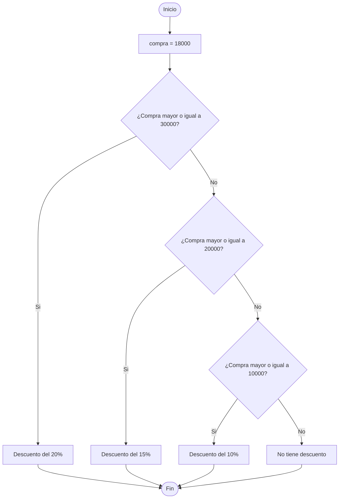

```mermaid
flowchart TD

A([Inicio]) --> B[compra = 18000]

B --> C{"¿Compra mayor o igual a 30000?"}

C-->|Si| D["Descuento del 20%"]
C-->|No| E{"¿Compra mayor o igual a 20000?"}

E-->|Si| F["Descuento del 15%"]
E-->|No| G{"¿Compra mayor o igual a 10000?"}

G-->|Si| H["Descuento del 10%"]
G-->|No| I["No tiene descuento"]

D --> J([Fin])
F --> J
H --> J
I --> J
```